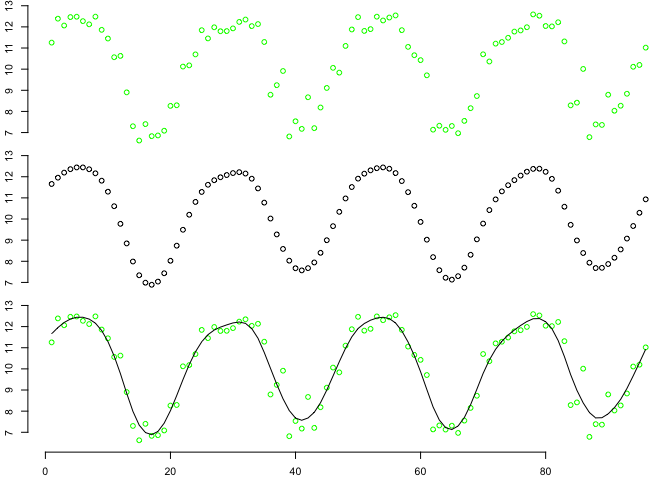
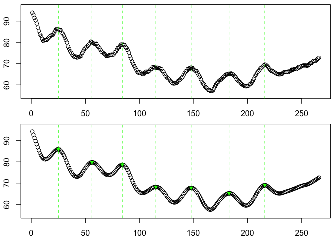

`caRey`
================

-   [Installation](#installation)
-   [Functions](#functions)
    -   [`progress()`](#progress)
    -   [`smoother()`](#smoother)
    -   [`peaks()`](#peaks)
    -   [`replace_tail()`, `replace_head()`](#replace_tail-replace_head)
-   [Bug reports](#bug-reports)

<!-- README.md is generated from README.Rmd. Please edit that file -->

[](https://travis-ci.com/nicholascarey/caRey)
[](https://ci.appveyor.com/project/nicholascarey/caRey)
[](https://codecov.io/github/nicholascarey/caRey?branch=master)
[](https://zenodo.org/badge/latestdoi/277777549)

The `caRey` package is a collection of R functions that may be useful in
general data management or processing.

### Installation

`caRey` can be installed using the `devtools` package:

``` r
install.packages("devtools")
devtools::install_github("nicholascarey/caRey")
```

### Functions

#### `progress()`

A simple progress bar function for use in loops or operations where you
want some indication of progress and how long it will take.

``` r
## Simple example with custom message
for(i in 1:1000) {
    Sys.sleep(0.01) # pause or this example will be too quick
    progress(i, max = 1000, message = "Operation progress")
    }
```

    #> [===========================                           ]  50% Operation progress

#### `smoother()`

A general data smoothing function with several methods including moving
average, splines, and loess regression.

``` r
smoother(sine_noisy.rd, method = "spline")
```



#### `peaks()`

A function that automatically identifies peaks (and troughs) in
oscillating data, with several options for adjusting the detection
sensitivity.

``` r
peaks(swim_y.rd, span = 5, smooth.method = "spline", smooth.n = 0.4, plot.which = "p")
```



#### `replace_tail()`, `replace_head()`

`replace_tail` is a simple solution for replacing the last `n` values in
a vector. There are lots of ways of extracting the last `n` values, and
a few of these can be used to replace them, but can be somewhat
inelegant, leading to difficult to read code such as:

``` r
## change last n values in x with 100
x[(length(x)-n+1):length(x)] <- 100
```

Instead, this function does the same job with either a value or vector

``` r
# # Replace last 5 numeric values with single value
x <- 1:10
replace_tail(x, 5, 100)
#>  [1]   1   2   3   4   5 100 100 100 100 100
```

``` r
# # Replace tail with a vector
x <- 1:20
replace_tail(x, r = 100:96)
#>  [1]   1   2   3   4   5   6   7   8   9  10  11  12  13  14  15 100  99  98  97
#> [20]  96
```

Replacing the initial `n` values is much more straightforward in `R`
syntax but `replace_head` makes a nice partner function and works the
same way.

### Bug reports

If you find any bugs, weird behaviour, or other issues please [let me
know](mailto:nicholascarey@gmail.com) or [open an
issue](https://github.com/nicholascarey/caRey/issues).
